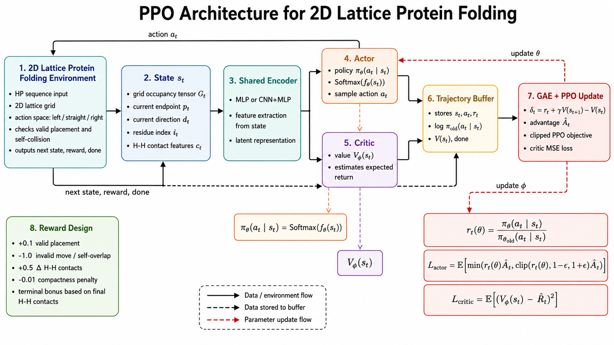

# PPO for Protein Folding Project Proposal

## 1. Project Goal

We formulate a simplified **protein folding** problem as a **reinforcement learning** task and solve it with **Proximal Policy Optimization (PPO)**.

To keep the project feasible, we use a **2D lattice protein folding environment** instead of full 3D atom-level folding.

Core idea:
- Input: a protein sequence such as `HHPHPPHH...`
- Agent: decides how to place the next residue on a 2D lattice
- Goal: fold the chain into a valid low-energy conformation
- Method: PPO with separate **Actor** and **Critic**

---

## 2. Why Protein Folding Can Be Modeled as RL

Protein folding can be expressed as a sequential decision-making problem:

- **State** `s_t`: current partial folded structure
- **Action** `a_t`: how to place the next amino acid
- **Transition**: environment updates the partial conformation
- **Reward** `r_t`: encourage legal, compact, low-energy folds
- **Episode end**: when the full sequence is placed or an invalid termination condition occurs

This matches the Markov Decision Process:

$$
\mathcal{M} = (\mathcal{S}, \mathcal{A}, P, R, \gamma)
$$

---

## 3. Simplified Environment Design

## 3.1 Protein Representation

Use the classic **HP model**:
- `H`: hydrophobic
- `P`: polar

The sequence is folded on a 2D grid.

Example:

`HHPHPHPPHH`

---

## 3.2 State Design

At step `t`, the state can include:

- current residue index `t`
- coordinates of all placed residues
- occupancy map of the lattice
- current moving direction
- local neighborhood around the current end point
- number of non-consecutive `H-H` contacts already formed

A practical state encoding:

$$
s_t = \{G_t, p_t, d_t, i_t, c_t\}
$$

where:
- `G_t`: lattice occupancy tensor
- `p_t`: current chain end position
- `d_t`: current direction
- `i_t`: residue index
- `c_t`: current contact statistics

---

## 3.3 Action Design

At each step, the agent places the next residue using one of:

- `0`: turn left
- `1`: go straight
- `2`: turn right

So the action space is:

$$
\mathcal{A} = \{ \text{left}, \text{straight}, \text{right} \}
$$

The environment converts the action into the next lattice coordinate.

Invalid action cases:
- self-overlap
- out-of-bound if a bounded board is used

---

## 3.4 Transition

Given state `s_t` and action `a_t`, the environment:

1. computes the next coordinate
2. checks whether the placement is valid
3. places the next residue if valid
4. updates contacts and compactness features
5. returns `s_{t+1}, r_t, done`

---

## 4. Reward Design

Reward is the most important part of this project.

We want PPO to learn:
- valid folding
- compact folding
- low-energy folding
- more hydrophobic contacts

Recommended reward:

$$
r_t = \lambda_1 r_{\text{valid}} + \lambda_2 r_{\text{contact}} + \lambda_3 r_{\text{compact}} + \lambda_4 r_{\text{terminal}}
$$

### 4.1 Validity Reward

- valid placement: `+0.1`
- invalid placement or self-overlap: `-1.0`

$$
r_{\text{valid}} =
\begin{cases}
0.1, & \text{if valid placement} \\
-1.0, & \text{if invalid placement}
\end{cases}
$$

### 4.2 Hydrophobic Contact Reward

If a new non-consecutive `H-H` neighbor pair is formed:

$$
r_{\text{contact}} = \Delta N_{HH}
$$

where `\Delta N_{HH}` is the number of newly created valid `H-H` contacts.

You can scale it, for example:

$$
r_{\text{contact}} = 0.5 \cdot \Delta N_{HH}
$$

### 4.3 Compactness Reward

Encourage smaller spatial spread:

$$
r_{\text{compact}} = - \alpha \cdot \Delta \text{BBoxArea}
$$

or use radius of gyration proxy:

$$
r_{\text{compact}} = - \alpha \cdot R_g
$$

### 4.4 Terminal Reward

At the end of the episode:

$$
r_{\text{terminal}} =
\begin{cases}
\beta \cdot N_{HH}^{\text{final}}, & \text{if sequence completely folded} \\
-2.0, & \text{if terminated by invalid move}
\end{cases}
$$

### 4.5 A Good First Version

For the first implementation, use:

$$
r_t = 0.1 \cdot \mathbf{1}_{\text{valid}} - 1.0 \cdot \mathbf{1}_{\text{invalid}} + 0.5 \Delta N_{HH} - 0.01 \Delta \text{BBoxArea}
$$

and

$$
r_T = 2.0 \cdot N_{HH}^{\text{final}}
$$

---

## 5. PPO Formulation

## 5.1 Actor

The actor outputs the action distribution:

$$
\pi_\theta(a_t \mid s_t)
$$

For discrete actions:

$$
\pi_\theta(a_t \mid s_t) = \text{Softmax}(f_\theta(s_t))
$$

where `f_\theta` is the policy network.

The selected action is sampled as:

$$
a_t \sim \pi_\theta(\cdot \mid s_t)
$$

---

## 5.2 Critic

The critic estimates the state value:

$$
V_\phi(s_t)
$$

This predicts expected discounted return:

$$
V_\phi(s_t) \approx \mathbb{E}\left[\sum_{k=0}^{T-t} \gamma^k r_{t+k} \,\middle|\, s_t \right]
$$

---

## 5.3 Advantage Estimation

Use GAE:

$$
\delta_t = r_t + \gamma V_\phi(s_{t+1}) - V_\phi(s_t)
$$

$$
\hat{A}_t = \delta_t + \gamma \lambda \delta_{t+1} + (\gamma \lambda)^2 \delta_{t+2} + \cdots
$$

---

## 5.4 PPO Objective for Actor

Define probability ratio:

$$
r_t(\theta) = \frac{\pi_\theta(a_t \mid s_t)}{\pi_{\theta_{\text{old}}}(a_t \mid s_t)}
$$

Clipped PPO objective:

$$
L^{\text{CLIP}}(\theta) =
\mathbb{E}_t
\left[
\min
\left(
r_t(\theta)\hat{A}_t,
\text{clip}(r_t(\theta), 1-\epsilon, 1+\epsilon)\hat{A}_t
\right)
\right]
$$

---

## 5.5 Critic Loss

$$
L^{\text{value}}(\phi) =
\mathbb{E}_t \left[ \left(V_\phi(s_t) - \hat{R}_t \right)^2 \right]
$$

where:

$$
\hat{R}_t = \hat{A}_t + V_\phi(s_t)
$$

---

## 5.6 Entropy Bonus

To encourage exploration:

$$
L^{\text{entropy}}(\theta) = \mathbb{E}_t \left[ \mathcal{H}(\pi_\theta(\cdot \mid s_t)) \right]
$$

---

## 5.7 Final PPO Objective

The optimization target is:

$$
L(\theta, \phi) =
L^{\text{CLIP}}(\theta)
- c_1 L^{\text{value}}(\phi)
+ c_2 L^{\text{entropy}}(\theta)
$$

Typical hyperparameters:
- `gamma = 0.99`
- `lambda = 0.95`
- `clip epsilon = 0.2`
- `c1 = 0.5`
- `c2 = 0.01`

---

## 6. PPO Architecture Diagram



If the Mermaid block below does not render in your viewer, the PNG above is the primary fallback figure for GitHub display.

```mermaid
flowchart LR
    A[Protein Sequence<br/>HP string] --> B[Protein Folding Environment]
    B --> C[State s_t<br/>grid occupancy<br/>current endpoint<br/>direction<br/>step index<br/>HH contact features]
    C --> D[Shared Encoder / Feature Extractor]
    D --> E[Actor Network<br/>policy pi_theta(a|s)]
    D --> F[Critic Network<br/>value V_phi(s)]
    E --> G[Action Distribution<br/>left / straight / right]
    G --> H[Sample Action a_t]
    H --> B
    B --> I[Reward r_t<br/>validity + contact + compactness + terminal]
    I --> J[Trajectory Buffer<br/>s_t, a_t, r_t, logpi_old, V(s_t)]
    F --> J
    J --> K[GAE Advantage Estimation<br/>A_hat_t, R_hat_t]
    K --> L[Actor Update<br/>PPO clipped loss]
    K --> M[Critic Update<br/>value MSE loss]
    L --> E
    M --> F
```

---

## 7. Formula-Based Architecture Summary

### Environment interaction

$$
a_t \sim \pi_\theta(a_t \mid s_t)
$$

$$
(s_{t+1}, r_t, done) = \text{Env}(s_t, a_t)
$$

### Actor

$$
\pi_\theta(a_t \mid s_t) = \text{Softmax}(f_\theta(s_t))
$$

### Critic

$$
V_\phi(s_t) = g_\phi(s_t)
$$

### Advantage

$$
\hat{A}_t = \text{GAE}(r_t, V_\phi(s_t), V_\phi(s_{t+1}))
$$

### Actor update

$$
L_{\text{actor}} =
\mathbb{E}_t
\left[
\min
\left(
r_t(\theta)\hat{A}_t,
\text{clip}(r_t(\theta), 1-\epsilon, 1+\epsilon)\hat{A}_t
\right)
\right]
$$

### Critic update

$$
L_{\text{critic}} =
\mathbb{E}_t \left[\left(V_\phi(s_t)-\hat{R}_t\right)^2\right]
$$

---

## 8. Recommended Network Structure

Because the environment is still small, the first version can use MLP.

### Option A: Simple MLP

- input: flattened local grid + scalar features
- hidden layers: `128 -> 128`
- actor head: `128 -> 3`
- critic head: `128 -> 1`

### Option B: CNN + MLP

If you encode the local occupancy map as an image-like tensor:

- CNN encoder for grid patch
- concatenate with step index / residue type / direction
- actor head outputs 3 logits
- critic head outputs 1 value

For HW, **Option A** is usually enough.

---

## 9. Suggested Code Structure

```text
HW4/
  README.md
  env/
    protein_folding_env.py
  models/
    actor_critic.py
  agent/
    ppo_agent.py
  train.py
  evaluate.py
  utils.py
  report/
    architecture_diagram.png
```

### File responsibilities

- `env/protein_folding_env.py`
  - HP sequence environment
  - state transition
  - collision checking
  - reward computation

- `models/actor_critic.py`
  - shared encoder
  - actor head
  - critic head

- `agent/ppo_agent.py`
  - rollout collection
  - GAE
  - PPO clipped update

- `train.py`
  - training loop
  - logging
  - checkpoint saving

- `evaluate.py`
  - load trained model
  - run deterministic policy
  - visualize fold and final score

---

## 10. Training Loop

1. initialize environment and PPO agent
2. collect trajectories with current policy
3. compute `log prob`, `value`, `reward`, `done`
4. compute `advantage` and `return`
5. update actor with PPO clipped objective
6. update critic with MSE loss
7. repeat until convergence

Pseudo flow:

$$
s_t \rightarrow \pi_\theta(a_t|s_t) \rightarrow a_t \rightarrow env \rightarrow r_t,s_{t+1}
$$

then:

$$
\{s_t,a_t,r_t\}_{t=1}^T \rightarrow \text{GAE} \rightarrow \text{PPO Update}
$$

---

## 11. Why This Version Is a Good HW Topic

Advantages:
- clearly an RL problem
- PPO is a standard and defendable method
- environment is custom and meaningful
- reward design is interesting and report-worthy
- easier than full 3D realistic protein folding

Possible limitations:
- this is a **toy folding model**, not AlphaFold-scale biology
- result quality depends strongly on reward shaping
- long sequences remain difficult

---

## 12. Final Recommendation

Your project title can be:

**Protein Folding with Proximal Policy Optimization in a 2D Lattice HP Model**

If the instructor wants a more formal statement:

**A Reinforcement Learning Approach to Simplified Protein Folding Using PPO**

---

## 13. What To Build Next

Next implementation order:

1. build `protein_folding_env.py`
2. build `actor_critic.py`
3. build `ppo_agent.py`
4. build `train.py`
5. add fold visualization
6. export the Mermaid diagram into a report figure
